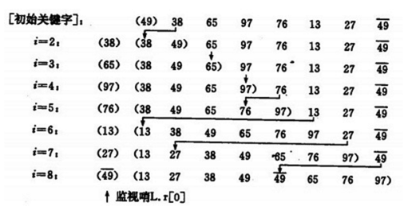

各种排序规则
====

### 1.冒泡排序

基本思想：

两两比较待排序数据元素的大小，发现两个数据元素的次序相反（大的在前，小的在后）时即进行交换，每一次扫描会把扫描区间最大的数字放在尾部。

位置：com.algorithm.bubbling.BubblingSort

### 2. 快速排序

基本思想：

选择最左边的一个元素作为基准元素，然后分别从两头开始与基准元素比较大小，最后形成以基准元素为分隔点，左边是较小的元素，右边是较大的元素。然后同样道理分别对左侧、右侧的子列表递归排序。

位置：com.algorithm.quick.QuickSort

### 3. 插入排序

基本思想：

每次选择一个元素K插入到之前已排好序的部分A[1…i]中，插入过程中K依次由后向前与A[1…i]中的元素进行比较，若A[x]>K，A[x]中的数字往后移，直到找不到，此时位置插入K。

位置：com.algorithm.insert.InsertSort

### 4. 堆排序

基本思想：

① 先将初始文件R[1..n]建成一个大根堆,此堆为初始的无序区

② 再将关键字最大的记录R[1](即堆顶)和无序区的最后一个记录R[n]交换，由此得到新的无序区R[1..n-1]和有序区R[n]，且满足R[1..n-1].keys≤R[n].key

③由于交换后新的根R[1]可能违反堆性质，故应将当前无序区R[1..n-1]调整为堆。然后再次将R[1..n-1]中关键字最大的记录R[1]和该区间的最后一个记录R[n-1]交换，由此得到新的无序区R[1..n-2]和有序区R[n-1..n]，且仍满足关系R[1..n-2].keys≤R[n-1..n].keys，同样要将R[1..n-2]调整为堆。

位置：com.algorithm.stack.StackSort
